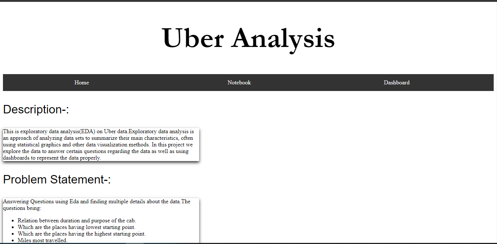

# uber-analysis
https://uber-analysis1.herokuapp.com/
This is exploratory data analysis(EDA) on Uber data.Exploratory data analysis is an approach of analyzing data sets to summarize their main characteristics, often using statistical graphics and other data visualization methods. In this project we explore the data to answer certain questions regarding the data as well as using dashboards to represent the data properly.
Libraries used-:pandas, numpy, matplotlib, seaborn and flask

